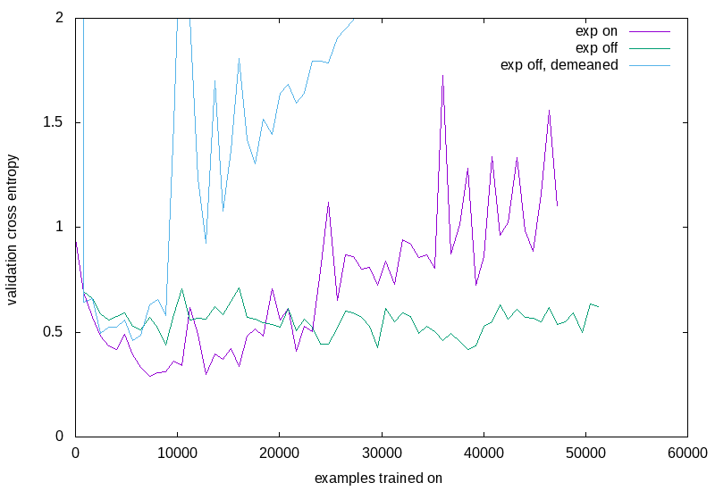
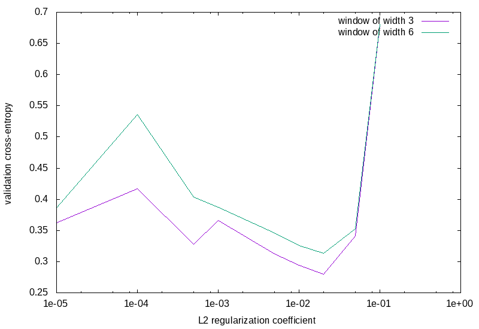
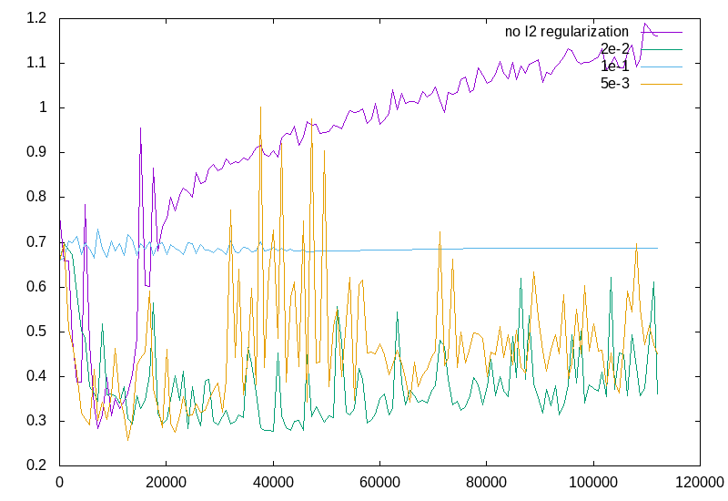
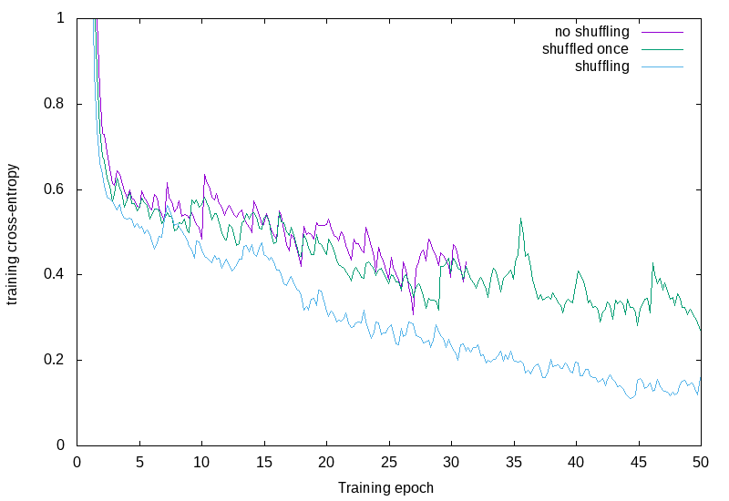

# Exponentiation

Changing the variable `exponentiation_base` to a real number `a` (rather than `None`) results in the image pixels `x` being transformed as `a^(x - x_max)` where `x_max` is the maximum pixel value in the band1 image.
The idea of this is that it appears to pick out the object more clearly to the human eye, and the image is already on a logarithmic scale.



Results are in the directories `exp_on`, `exp_off` and `exp_off_demean`.
Runs were performed with version `27c08c7308b9fa6e32dad7f64541b4ea3b5b97f7`.

It doesn't look like it works very well - any what's going on with the demeaned case? Why does the validation cross-entropy suddenly jump?

# L2 Regularization

I added L2 regularization of all of the weights in the network.
Changing the variable `l2_penalty` in `net_params` sets this.

Runs were performed with the settings
```python
params = {
    'dataset_params' : {
        'flips' : False,
        'demean' : False,
        'range_normalize' : True,
        'exponentiate_base' : None,
        'add_noise' : False,
    },
    'net_params' : {
        'conv1_size' : 5,
        'conv1_channels' : 32,
        'conv2_size' : 5,
        'conv2_channels' : 32,
        'fc1_size' : 1024,
        'fc2_size' : 128,
        'dropout_keep_prob': 0.8,
        'l2_penalty' : args.l2penalty
    }
}
```
I haven't kept all of the runs because they took up too many directories.
Runs were performed with version `de718370c30a5da0b46da340ce501c0b82bb8816`.
I took a moving window of the validation cross-entropies, and found the window in which the maximum cross-entropy was minimised.
This cross-entropy is what is plotted below.



Clearly `2e-2` works best *for this net*.



We can see above that the regularization doesn't really make the minimum any deeper, but it does make it stable over a longer training horizon.

# Shuffling training data

I noticed that when I turned down the size of the validation set, the training error stopped decreasing!
This is weird, since it was only adding 50% more data.
It turns out that the last 95 rows of the training set are all ships.
So two batches were training with entirely ships.

I wrote a new data input class that allows shuffling of the data.



The figure shows that just shuffling that data once doesn't do much.
We really should do independent selection for each training epoch.

Note that this isn't a perfect comparisson to the situation I was seeing before - I didn't implement normalisations in this dataset yet, so the 'unshuffled' case doesn't exactly match the previous situation.

Runs were performed with the settings
```python
params = {
    'dataset_params' : {
        'flips' : False,
        'demean' : False,
        'range_normalize' : True,
        'exponentiate_base' : None,
        'add_noise' : False,
        'shuffle' : args.shuffle_dataset
    },
    'net_params' : {
        'conv1_size' : 5,
        'conv1_channels' : 32,
        'conv2_size' : 5,
        'conv2_channels' : 32,
        'fc1_size' : 1024,
        'fc2_size' : 128,
        'dropout_keep_prob': 0.8,
        'l2_penalty' : args.l2penalty
    }
}
```
The version was `564cb65fc51d08672250472caeff20da0686202f`.
